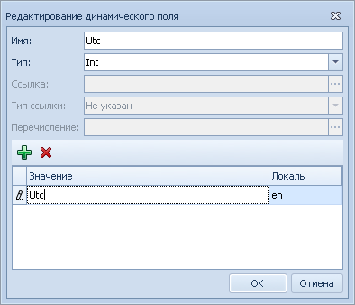
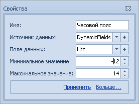

[[ariaid-title1]]
== Настройка Справочника серверов

=== Настройка коррекции времени

Если в межфилиальном обмене участвуют сервера Docsvision, находящиеся в разных часовых поясах, МФО может автоматически корректировать время в заданиях, пересылаемых между серверами. Данная функция реализована для базовых сценариев, приведённых в ПРИЛОЖЕНИИ xref:Appendix_A.adoc[Список базовых сценариев обмена].

Если функция коррекции не требуется, перейдите к следующему пункту «Заполнение Справочника серверов».

Для настройки функции автоматической коррекции времени выполните перечисленные далее действия.

. Добавьте в метаданные [.dfn .term]_карточки сервера_ поле с названием «Utc»:
[loweralpha]
.. В [.dfn .term]_Конструкторе разметок_ выберите вид [.dfn .term]_Карточка сервера_ (библиотека «Базовые объекты»).
.. Откройте меню [.ph .uicontrol]*Редактирование метаданных* (кнопка ). Вид должен быть заблокирован для редактирования.
.. Создайте новую расширенную секцию типа «Struct» с произвольным названием (например, «DynamicFields»).
.. Создайте в добавленной секции расширенное поле (кнопка ) с названием «Utc» (название важно) и типом «Int».
+

.. Сохраните изменения.
+
Инструкция по работе с расширенными метаданными приведена в документации модуля «Базовые объекты».
. Добавьте поле «Utc» в разметку [.dfn .term]_карточки сервера_:
[loweralpha]
.. Откройте разметку карточки вида [.dfn .term]_Карточка сервера_.
.. Перетащите на разметку элемент управления «Целое число».
.. Настройте элемент управления (команда [.ph .uicontrol]*Свойства* контекстного меню) следующим образом:
+

+
Здесь в источнике данных выбрано созданное поле «Utc». Рекомендуемый диапазон значений коррекции для UTC: от -12 до +14.
+
На следующем изображение пример разметки [.dfn .term]_карточки сервера_ с новым полем.

image::img/reflayoutserver.png[image]
+
*Если в организации используется [.dfn .term]_Модуль репликации справочников_, то перед выполнением следующего шага инструкции синхронизируйте Справочники серверов с помощью [.dfn .term]_Модуля репликации справочников_.*
. Аналогичным образом настройте разметку [.dfn .term]_карточки сервера_ на других серверах Docsvision, участвующих в обмене.

Если в организации используется [.dfn .term]_Модуль репликации справочников_, то настройки, перечисленные в следующих двух пунктах, уже были выполнены. В этом случае рекомендуется убедиться, что всё верно – повторно выполнять настройку не требуется (за исключением указания часового пояса в карточках серверов, если требуется коррекция времени).

Если [.dfn .term]_Модуль репликации справочников_ не используется – настройку нужно выполнить.

=== Заполнение Справочника серверов

В Справочник серверов нужно добавить все сервера Docsvision, участвующие в обмене.

. Откройте [.dfn .term]_Справочник серверов_ в Windows-клиенте.
. Нажмите кнопку image:img/buttons/add.png[image]. Будет открыто окно добавления сервера.
. Укажите информацию о сервере Docsvision:
* Наименование – краткое название сервера.
* Полное название.
* Описание – дополнительная информация о сервере – если требуется.
* Часовой пояс – часовой пояс, в котором находится данный сервер Docsvision – если нужна функция автоматической коррекции времени в передаваемых между серверами карточках.
* Адрес подключения – адрес подключения к данному серверу Docsvision в формате [.ph .filepath]`http://<Имя сервера Docsvision>/DocsVision/StorageServer/StorageServerService.asmx`.
* База данных – название базы Docsvision – указывается, если обмен должен выполняться не с БД по умолчанию.
* Пользователь/ Пароль – данные учетной записи, от имени которой будет выполняться подключение к данному серверу с других серверов Docsvision. Данный пользователь должен быть зарегистрирован в [.dfn .term]_Справочнике сотрудников_ и иметь права:
** на запись в справочники «Каталог файлов», «Очередь событий».
** на чтение всех справочников МФО.
+
Рекомендуется, для избежания возможных ошибок, связанных с недостаточностью прав, предоставить данному пользователю права администратора Docsvision.
+
image::img/refserverform.png[[.fig--title-label]##Рис. 1. ##Пример заполнения Справочника серверов]
. После заполнения данных на одном из серверов Docsvision, справочник нужно скопировать на другие сервера Docsvision, участвующие в обмене. Для этого можно использовать [.dfn .term]_Модуль репликации справочников_.
+
При изменении [.dfn .term]_Справочника серверов_ на одном из серверов данные изменения нужно перенести на все остальные сервера Docsvision.

[NOTE]
====
[.note__title]#Важное замечание:# [.dfn .term]_Справочники серверов_ на всех серверах Docsvision, участвующих в обмене, должен быть синхронизированы. Это является важным условием для корректной работы МФО.
====

=== Идентификация сервера Docsvision

В конфигурации сервера Docsvision нужно зафиксировать идентификатор данного сервера. Идентификатор сервера необходим для работы алгоритмов загрузки и определения адресатов.

*Следующие действия вносят изменения в БД Docsvision. Перед продолжением рекомендуется создать резервную копию.*

. Определите идентификатор сервера Docsvision:
[loweralpha]
.. Запустите утилиту [.keyword]*Docsvision Explorer* (входит в комплект инструментов разработчика «Docsvision 5 Resource Kit»).
.. Выберете тип карточки «Справочник серверов».
.. Перейдите в секцию «Серверы» и выберите из списка серверов текущий сервер (ориентируйтесь по полному наименованию – поле «FullName»).
.. Запишите или запомните идентификатор сервера, указанный в поле «ServerId».
. Откройте БД Docsvision, например, в «Microsoft SQL Server Management Studio». Пользователь должен иметь права на запись в таблицу [.keyword]*dvsys_settings*.
. Выполните скрипт, указав в переменной `@ServerID` полученный идентификатор сервера Docsvision.
+
[source,pre,codeblock]
----
DECLARE @ServerID uniqueidentifier

-- Укажите здесь идентификатор данного сервера Docsvision, определенный в Справочнике серверов
SET @ServerID = '00000000-0000-0000-0000-000000000000'

EXECUTE [dbo].[dvreport_get_data_{6037ce71-6fe8-4b48-9f3f-86e988642570}] 
        @ServerID
GO
----
. Перезагрузите сервер Docsvision.
. Выполните аналогичные действия на всех серверах Docsvision, участвующих в обмене.

*На уровень выше:* xref:../topics/HowConfig.adoc[Подготовка к работе]
