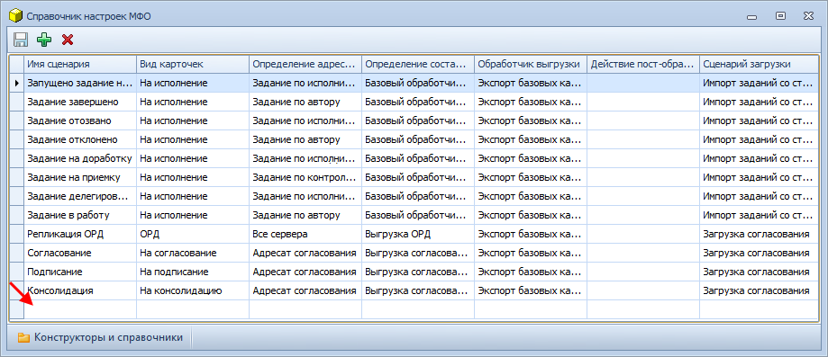
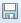

[[ariaid-title1]]
== Создание нового сценария обмена

. Откройте [.dfn .term]_Справочника настроек МФО_.
. Нажмите кнопку image:img/buttons/add.png[image] на панели инструментов. В конец списка сценариев будет добавлена новая строка.
+
##Рис. 1. ##Новый сценарий в Справочнике настроек МФО]
[loweralpha]
.. В столбце «Имя сценария» укажите уникальное название сценария обмена.
.. В столбце «Вид карточек» выберите вид, для обмена которыми предназначен данный сценарий.
.. Выберите [.dfn .term]_компоненты обмена_ в столбцах:
* «Определение адресатов»,
* «Определение состава передачи»,
* «Обработчик выгрузки»,
* «Сценарий загрузки».
+
Если [.dfn .term]_компонент определения состава передачи_, [.dfn .term]_компонент определение адресатов_ или [.dfn .term]_компонент загрузки_ не выбран, в сценарии обмена будет использована реализация по умолчанию. Описание данных компонентов приведено в ПРИЛОЖЕНИИ xref:BaseScrypt_Def.adoc[Описание компонентов обмена по умолчанию].
+
Если требуется, могут быть разработаны собственные [.dfn .term]_компоненты обмена_. Инструкция приведена в [.dfn .term]_Руководстве программиста_.
.. Если после загрузки данных требуется выполнить дополнительные действия:
[lowerroman]
... Разработайте БП, выполняющий требуемые действия.
+
Параметры работы [.dfn .term]_сценария обмена_ в БП не передаются.
... Выберите данный БП в столбце «Действия пост-обработки».
+
Для очистки значения поля нажмите клавишу «Delete».
. Нажмите на кнопку  на панели инструментов справочника.
. Перенесите изменения [.dfn .term]_Справочника настроек МФО_ на все сервера Docsvision, участвующие в обмене. Для этого рекомендуется использовать [.dfn .term]_Модуль репликации справочников_.
. Если для сценария были разработаны собственные [.dfn .term]_компоненты обмена_ и/или БП пост-обработки, их необходимо перенести на все сервера Docsvision.

*На уровень выше:* xref:../topics/HowNewConfig.adoc[Настройка нового сценария обмена]
