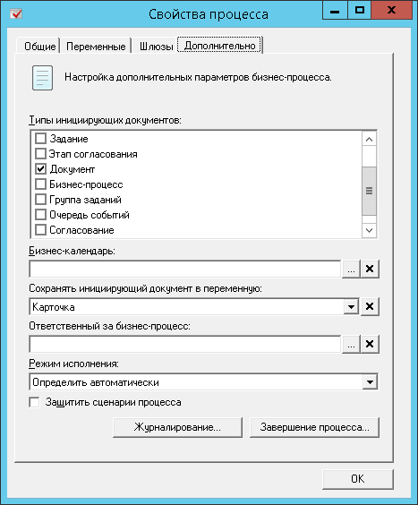

[[ariaid-title1]]
== Настройка БП «Регистрация события МФО»

БП «Регистрация события МФО» добавляет событие обмена в [.dfn .term]_очередь событий_, когда изменяется состояние карточки или выполняется определенная операция с карточкой. Для каждого события или операции нужно создать и настроить собственную копию бизнес-процесса "Регистрация события МФО" (далее – [.keyword]*рабочая копия*).

Чтобы настроить рабочую копию БП регистрации событий:

. Скопируйте БП «Регистрация события МФО». Далее копия данного БП будет называться [.dfn .term]_рабочей копией_.
+
[.dfn .term]_Рабочая копия_ должна быть доступна всем сотрудникам.
. Откройте настройки [.dfn .term]_рабочей копии_ и перейдите на вкладку [.keyword .wintitle]*Переменные*.
+
image::img/bpform1.png[image]
. В переменной `Тип события (ID)` укажите идентификатор [.dfn .term]_сценария обмена_ (из [.dfn .term]_Справочника настроек МФО_), для запуска которого будет применяться данный БП. Идентификатор должен быть заключен в фигурные скобки (например, «\{10000000-2000-3000-4000-500000000000}»).
+
Идентификатор [.dfn .term]_сценария обмена_ можно узнать используя программу [.keyword]*Docsvision Explorer* (входит в комплект инструментов разработчика «Docsvision 5 Resource Kit»):

[loweralpha]
.. Выберете тип карточки [.dfn .term]_Справочник настроек МФО_.
.. Перейдите в секцию «Сценарий обмена».
.. Выберите из списка сценарий, идентификатор которого ищется. Можно ориентироваться на название сценария (поле «Name»).
+
Искомый идентификатор сценария будет указан в поле «RowID».
. В переменной `Карточка` выберите тип карточек, для которых реализуется [.dfn .term]_сценарий обмена_.
. Перейдите на вкладку [.keyword .wintitle]*Дополнительно*.
+

. В списке [.ph .uicontrol]*Типы инициирующих документов* выберите типы карточек, из которых может быть запущен БП «Регистрация события МФО». Следует выбрать тип карточек, для которой реализуется сценарий обмена.
. В поле [.ph .uicontrol]*Сохранять инициирующий документ в переменную* выберите значение `Карточка`.
. Сохраните БП.
. Скопируйте [.dfn .term]_рабочую копию_ на все сервера Docsvision, участвующие в межсерверном обмене.

*На уровень выше:* xref:../topics/HowNewConfig.adoc[Настройка нового сценария обмена]
