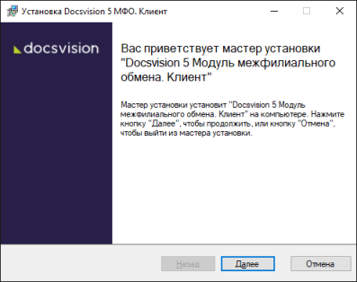
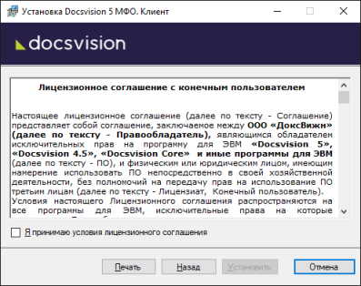

[[ariaid-title1]]
== Установка клиентской части Модуля

Клиентская часть Модуля межфилиального обмена должна быть установлена на компьютеры пользователей Docsvision, работающих в Windows-клиенте.

. Запустите пакет установки [.ph .filepath]`Docsvision 5 Replication client.msi`.
+
Клиентская часть модуля должна быть установлена с областью установки (все пользователи или текущий пользователь), с которой на данном компьютере был установлен Windows-клиент.
+
Для установки с областью «Для всех пользователей» выполните от имени администратора: `msiexec /i "Docsvision 5 Replication client.msi"       ALLUSERS=1`
+
Будет открыт мастер установки.

##Figure 1. ##Мастер установки клиентской части МФО]
. Примите условия лицензионного соглашения для продолжения установки и нажмите кнопку [.ph .uicontrol]*Установить*.
+
##Figure 2. ##Условия лицензионного соглашения]
. На следующем экране нажмите кнопку [.ph .uicontrol]*Готово*.

*Parent topic:* xref:../topics/Install_and_configuration.adoc[Установка и настройка]
