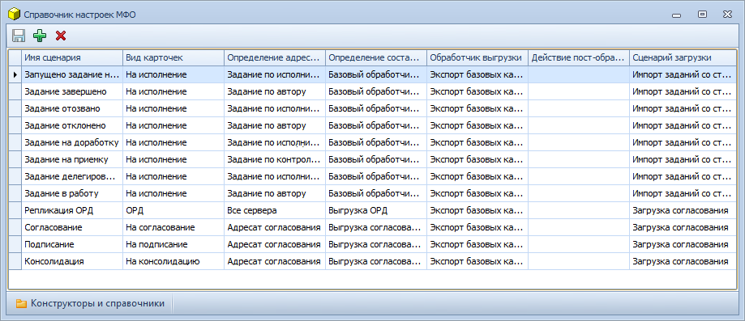

[[ariaid-title1]]
== Справочник настроек МФО

Настройка [.dfn .term]_сценариев обмена_ осуществляется с помощью [.dfn .term]_Справочник настроек МФО_, интерфейс которого представлен на следующем рисунке.

##Рис. 1. ##Главное окно Справочника настроек МФО]

Главное окно [.dfn .term]_Справочника настроек МФО_ содержит следующие данные:

* Имя сценария – название [.dfn .term]_сценария обмена_;
* Вид карточек – вид карточек, с которыми работает [.dfn .term]_сценарий обмена_;
* Определение адресатов – название [.dfn .term]_компонента обмена_, используемого для получения списка серверов Docsvision, на которые должны быть отправлены синхронизируемые карточки.
* Определение состава передачи – название [.dfn .term]_компонента обмена_, используемого для получения списка карточек, которые будут выгружены для передачи на удаленный сервер.
* Обработчик выгрузки – название [.dfn .term]_компонента обмена_, используемого для выгрузки данных карточек, отправляемых на удаленный сервер.
* Сценарий загрузки – название [.dfn .term]_компонента обмена_, используемого для загрузки данных на сервере-получателе.
* Действие пост-обработки – бизнес-процесс Docsvision, который будет запущен на сервере [.dfn .term]_получателя_ после завершения загрузки данных у получателя. К бизнес-процессу не предъявляется отдельных условий на механизм работы, т.е. он может реализовывать любую функциональность, которая необходима для выполнения бизнес-задачи.

*На уровень выше:* xref:../topics/Administrator_functions.adoc[Функции администратора]
